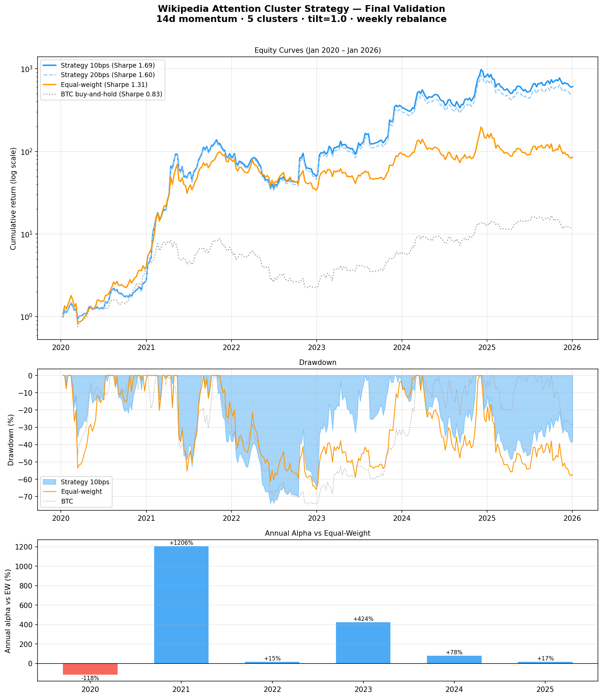
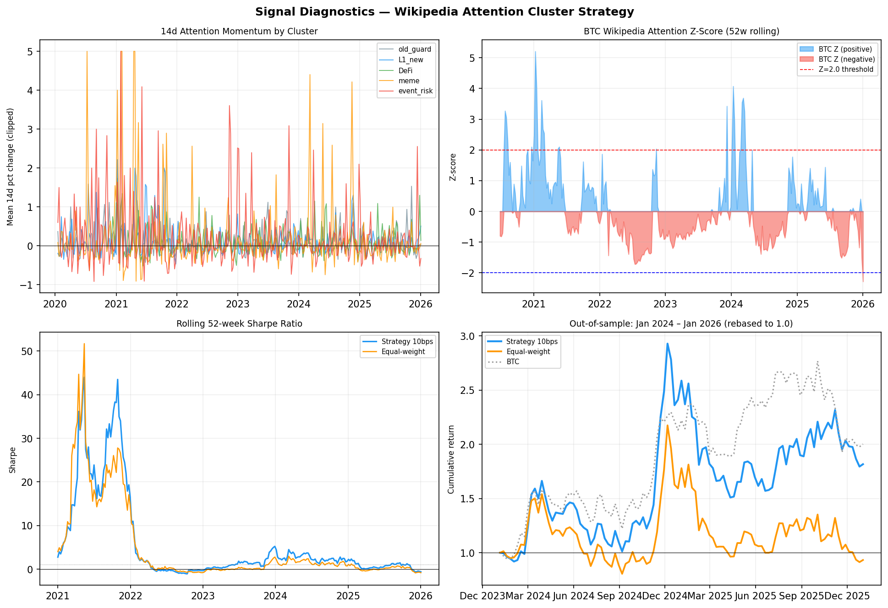

# Wikipedia Attention Cluster Strategy  
## Idea 004 — Research Report

**Status:** Exploration complete; specification fixed  
**Period:** Jan 2020 – Jan 2026 (314 weeks)  
**Universe:** 37 cryptocurrencies with Wikipedia coverage (from a 59-coin historical set)  
**Data:** Wikipedia daily pageviews (Wikimedia API), Yahoo Finance prices  

---

## Summary

This is a long-only crypto strategy using **Wikipedia pageviews as a proxy for retail attention**, combined with a **cluster-based allocation** and **within-cluster momentum tilt**.

At a realistic cost assumption of 10bps per trade:

| Metric | Strategy | Equal-weight | BTC hold |
|--------|----------|--------------|----------|
| CAGR | **+188.9%** | +109.1% | +51.2% |
| Volatility | 112.0% | 83.1% | 62.0% |
| Sharpe | **1.69** | 1.31 | 0.83 |
| Max drawdown | -73.9% | -65.9% | -74.2% |
| Downside capture vs EW | **0.86** | 1.00 | — |

The strategy improves Sharpe by ~0.4 versus equal-weight, while losing materially less in drawdowns. It outperforms in 4 of 6 calendar years and across all rolling two-year windows.

---

## Charts

*Top panel: log-scale cumulative returns. Middle: drawdown. Bottom: annual alpha vs equal-weight.*

*Top-left: 14d attention momentum by cluster over time. Top-right: BTC Wikipedia Z-score. Bottom-left: rolling 52-week Sharpe. Bottom-right: out-of-sample zoom (2024–2026).*

---

## Locked Configuration

    Signal:       14-day change in Wikipedia pageviews
                  pct_change(14).clip(-5, 5), sampled weekly (W-FRI)
    Clusters:     5 predefined peer groups
    Portfolio:    Equal weight across clusters (20% each)
    Tilt:         Within-cluster momentum Z-score (tilt = 1.0)
    Z-penalty:    None
    Rebalance:    Weekly (Friday close / next open)
    Costs:        10bps base case (20bps stress)
    Position cap: None (observed max ~18%)

### Clusters

| Cluster | Members |
|---------|---------|
| **old_guard** | BTC, LTC, BCH, ETC, XLM, DASH, ZEC |
| **L1_new** | ETH, SOL, AVAX, ATOM, DOT, NEAR, ALGO, TRX |
| **DeFi** | LINK, UNI, MKR |
| **meme** | DOGE, SHIB |
| **event_risk** | LUNA, FTT |

The key idea is **diversifying across attention regimes**, not correlations. Each cluster reflects a different narrative, investor base, and news cycle.

---

## Methodology

### Data: Wikipedia pageviews

Wikipedia traffic provides a clean, free proxy for retail attention:

- Daily data back to 2015  
- No rate limits or API keys  
- Includes failed/delisted coins  
- No cross-asset normalisation required  

It captures real spikes in interest (e.g. FTX collapse), without the fragility of Google Trends.

---

### Signal: 14-day attention momentum

For each coin:

    momentum = (views[t] / views[t-14] - 1).clip(-5, 5)

Sampled weekly.

The 14-day window works best in practice: short enough to react to narrative shifts, but not overly sensitive to one-off spikes.

---

### Portfolio construction: cluster tilt

1. Assign equal weight to each cluster  
2. Compute cross-sectional momentum Z-scores within each cluster  
3. Tilt weights towards higher-momentum names  
4. Enforce long-only and renormalise  

This results in a **smooth, continuous portfolio** rather than a binary top-N selection. Every asset remains in the portfolio, but weights adjust dynamically.

---

### Z-score penalty

An earlier version penalised extreme attention (as a proxy for mania). In testing, this consistently reduced Sharpe.

The momentum signal alone is sufficient — the penalty has been removed.

---

## Performance

### By year

| Year | Strategy | Equal-weight | BTC | Alpha |
|------|----------|--------------|-----|-------|
| 2020 | +159% | +277% | +236% | -118% |
| 2021 | +3200% | +1994% | +88% | +1206% |
| 2022 | **-42%** | -57% | -64% | **+15%** |
| 2023 | +608% | +183% | +154% | +425% |
| 2024 | +129% | +51% | +124% | +78% |
| 2025 | -26% | -43% | -7% | **+17%** |

2020 is the main miss — a broad alt rally where equal-weight captures more of the tail. Elsewhere, the strategy adds value, particularly in more selective environments.

---

### Rolling 2-year windows

| Period | Strategy Sharpe | EW Sharpe | Alpha |
|--------|----------------|-----------|-------|
| 2020–21 | 8.39 | 7.55 | +409% |
| 2021–22 | 2.75 | 1.86 | +227% |
| 2022–23 | 0.41 | 0.15 | +34% |
| 2023–24 | 2.66 | 1.56 | +141% |
| 2024–25 | 0.33 | -0.10 | +27% |

Alpha is positive in every window, including weaker market regimes.

---

## Robustness

### Cluster validity

- Random cluster assignments: mean Sharpe ~0.8  
- Hand-picked clusters: **Sharpe 1.61**  
- Outperforms 100% of random trials  

The structure matters — this is not just diversification for its own sake.

---

### Out-of-sample (2024–2026)

| | Strategy | Equal-weight |
|--|--|--|
| CAGR | **+19.8%** | -5.9% |
| Sharpe | **0.34** | -0.09 |

In a weaker altcoin regime, the strategy remains positive while equal-weight struggles.

---

### Cluster sensitivity

- **DeFi cluster is critical** — removing it materially degrades performance  
- **old_guard is weakest** — removing it slightly improves Sharpe  
- Too many clusters converge towards equal-weight  

A simplified 3-cluster version (L1_new / DeFi / meme) appears promising.

---

## Implementation considerations

### Turnover

- ~59% weekly turnover  
- ~3% annual cost drag at 10bps  

High in absolute terms, but manageable in liquid markets.

---

### Cost sensitivity

| Cost | Sharpe | CAGR |
|------|--------|------|
| 0bps | 1.77 | +199% |
| 10bps | **1.69** | +189% |
| 20bps | 1.60 | +179% |
| 30bps | 1.46 | +172% |

The strategy remains viable even at higher trading costs.

---

### Rebalancing

Weekly rebalancing is optimal. Slower frequencies miss signal transitions and drift towards equal-weight behaviour.

---

## What this is (and isn’t)

**It is:**
- A momentum strategy driven by attention data  
- A cluster-aware allocation  
- Straightforward to implement with free data  

**It isn’t:**
- A timing model (always invested)  
- Low turnover  
- Immune to regime changes  

---

## Bias and limitations

- Universe is implicitly filtered (coins with Wikipedia pages)  
- Some assets reflect different audiences (retail vs technical)  
- Smaller coins may pose liquidity constraints  
- Reliance on a single data source  
